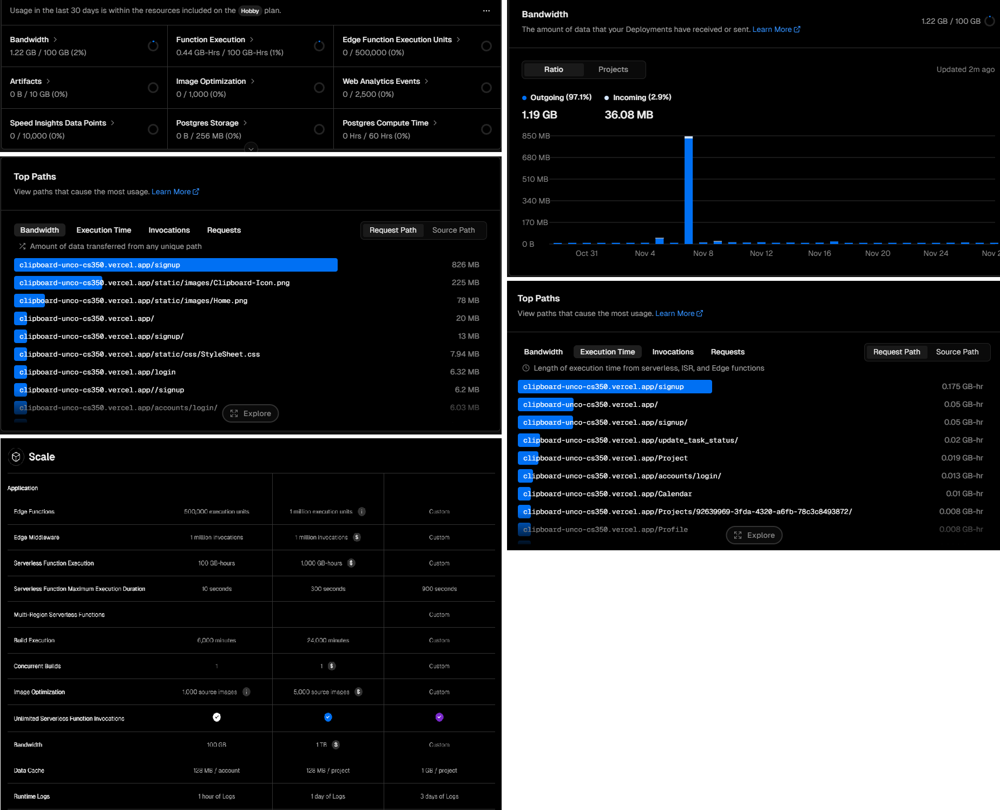
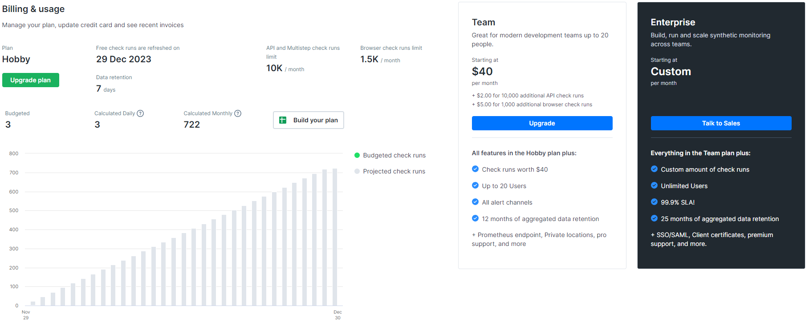

# Dev Ops Report

## Milestone 7 - Design - Joel LeFevre

---

## MongoDB Scalability Assessment

### Current Usage Analysis
* 
  * Our current MongoDB usage stands at approximately 606 KB out of the 512MB cap on our free shared plan.
    * Our data usage could potentially grow by approximately 845 times before hitting the storage limit.

### Scaling Options Offered by MongoDB
* Reviewing [MongoDB's Pricing](https://www.mongodb.com/pricing):
  * We have the option to transition to a serverless plan offering up to 1TB of storage at $0.25 per GB-Month.
    * Read operations incur a cost of $0.10 per million times, while write operations cost $1.00 per million writes.
  * This plan includes 2 free daily backups, with additional restored backups costing $2.50/hour.

---

## Vercel Scalability Assessment

### Current Usage Overview
* 
  * Our recent usage on Vercel indicates ~400MB of data consumption within the last month, excluding a stress test that consumed ~800MB of bandwidth in November.
    * Given our 100GB cap, the site usage could expand by approximately 250 times before reaching the bandwidth limit.
  * Noteworthy insights from Vercel's built-in metrics:
    * High execution times were observed on the home page and updating task statuses in the Project page.

### Scaling Options Offered by Vercel
* Referencing [Vercel's Pricing](https://vercel.com/pricing):
  * In case of hitting the 100GB bandwidth cap, an expansion to Vercel's Pro tier at $20 per month per team member is feasible.
    * The Pro tier offers a bandwidth cap one order of magnitude higher and limited DDoS protection not available in the free tier.
  * Further scalability can be achieved with Vercel's Enterprise tier, offering custom pricing tailored to specific project needs, necessitating engagement with their sales team for specific pricing.

---

## Checkly Scalability Assessment

### Current Usage Analysis
* 
  * Presently, we execute approximately 700 checks monthly, verifying the home page's status hourly and upon each website update.
    * Alerts are triggered via email if the site experiences downtime.
  * Our current free plan permits 1,500 monthly checks, indicating that we are utilizing around 700 checks.

### Scaling Options Offered by Checkly
* Reviewing [Checkly's Billing Page](https://app.checklyhq.com/billing/):
  * Upgrading to the Pro plan at $40 per month would allow for checks every 10 minutes, offering 6,000 monthly browser checks.
    * Considering our usage, which amounts to approximately 4,400 browser checks monthly, around 1,600 checks would remain for deployment-related checks.
  * Additionally, the Pro plan unlocks various alert types, including SMS alerts, enabling quicker notifications within 10 minutes of site downtime.

---

### Conclusion

This comprehensive report outlines the scalability options available for MongoDB, Vercel, and Checkly monitoring. It provides insights into current usage, potential scalability, and associated costs for each service, ensuring a proactive approach to accommodate the growing needs of our application.

**Next Steps**
1. Evaluate the projected growth trajectory and align it with the appropriate tier upgrades in MongoDB, Vercel, and Checkly.
2. Consider cost-effectiveness and benefits for each tier upgrade to optimize resource allocation.
3. Initiate necessary upgrades to ensure seamless scalability and enhanced performance across the services.

The detailed assessments provided here offer valuable insights into scaling strategies for MongoDB, Vercel, and Checkly, essential for maintaining application reliability and performance amidst growth.
